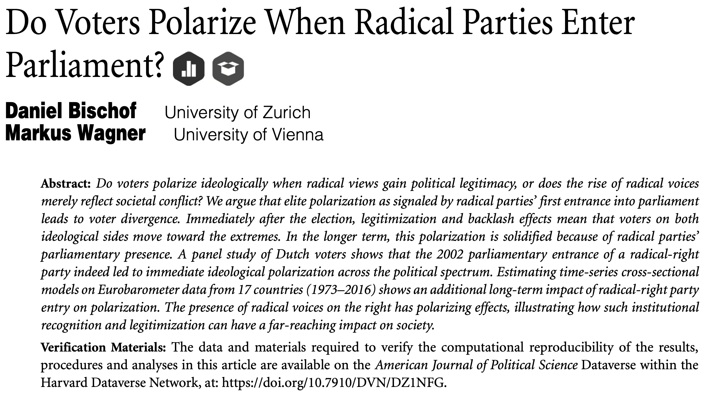

```{r setup, echo=FALSE, message=FALSE, results='hide'}
# The first line sets an option for the final document that can be produced from
# the .Rmd file. Don't worry about it.
knitr::opts_chunk$set(echo = TRUE)

# The next bit (lines 50-69) is quite powerful and useful. 
# First you define which packages you need for your analysis and assign it to 
# the p_needed object. 
p_needed <-
  c("viridis", "knitr", "plotrix")

# Now you check which packages are already installed on your computer.
# The function installed.packages() returns a vector with all the installed 
# packages.
packages <- rownames(installed.packages())
# Then you check which of the packages you need are not installed on your 
# computer yet. Essentially you compare the vector p_needed with the vector
# packages. The result of this comparison is assigned to p_to_install.
p_to_install <- p_needed[!(p_needed %in% packages)]
# If at least one element is in p_to_install you then install those missing
# packages.
if (length(p_to_install) > 0) {
  install.packages(p_to_install)
}
# Now that all packages are installed on the computer, you can load them for
# this project. Additionally the expression returns whether the packages were
# successfully loaded.
sapply(p_needed, require, character.only = TRUE)

source("plot_expo.R")
```

------------------------------------------------------------------------

# Program for today

0. Preface: Finding Inspiration for the Data Essay

In this session, we will learn about maximum likelihood estimation:

1.  Likelihood as a model of inference

    -   The Univariate Case with Exponential Distribution
    -   Numerical Optimization of the log-likelihood

2.  Maximum Likelihood and the Linear Regression Model

    -   You will write your own Maximum Likelihood Function for the linear model and optimize it in the exercise section

3.  ML variance estimate is biased

    -   We will explore the properties of the estimator with simulation

------------------------------------------------------------------------

# Preface: Finding Inspiration for the Data Essay

You are in a tricky situation: We want you to find a topic for a term paper where you use methods that you don't know yet. Unfortunately, all I can say is that you have to trust the process. Many cohorts before you were in that situation, but they all managed to find a topic and apply the methods we are teaching mostly in the second half of the course. If you are currently stuck, here are some things that may help you:

- The dependent variable of a study is key! As you already know, the choice of your statistical model depends on how the dependent variable is scaled. In general, all scales are fine, but the default for continuous DVs is linear regression. But there are some options:

  + Papers where the dependent variable is ordered or categorical are always candidates to build up on.
  + Maybe you find a paper where the dependent variable is treated as continuous, but there are arguments why it actually should not be treated as such.
      - maybe the variable can't take values below zero (or another threshold--think of electoral thresholds)
      - maybe the variable is ordinal or even binary
  + If the DV is continuous, you can make arguments about the variance component (more about this very soon).
  + Sometimes it can be interesting to think about alternative dependent variables. In that case, you could use most of the data of a published paper, and try to add data for a new outcome variable.
  
Here are three brief examples of past projects:

### 1. Risk attitudes and political intrerest as drivers of populist right voting?

**Starting point**: Oshri et al (2021): Risk Aversion and the Gender Gap in the Vote for Populist Radical Right Parties. _American Journal of Political Science_.


**Key finding of the AJPS paper**: Gender differences in risk-taking help explain why men are more likely to vote for populist radical right parties than women.

**Contribution of the data essay**: Instead of looking only at people who actually voted, the term paper included abstaining as an outcome option. In that way, the dependent variable that was binary in the original study (vote for PRRP or not) became categorical (vote for PRRP, other party, or abstain).

### 2. Labour Union Membership and Racism

**Starting point**: Frymer & Grumbach (2021): Labour Unions and White Racial Politics


**Key finding of the AJPS paper**: White labor union members show lower racial resentment than non-members.

**Contribution of the data essay**: Union members are a more homogeneous group than non-union members. Therefore, there should be less variation in racial resentment among union members than among non-members. This argument was tested with a heteroskedastic linear regression model.

### 3. Party Entry of Radical Right Parties and Voter Polarization

**Starting point**: Bischof & Wagner (2019): Do Voters Polarize When Radical Parties Enter Parliament? _American Journal of Political Science_.



**Key finding of the AJPS paper**: Voters polarize after radical right parties enter the national parliament.

**Contribution of the data essay**: Original study constructs a polarization measure based on voters left-right placements (squared distance to median position) and it as DV in an linear regression (OLS). Authors of this paper incorporated polarization in error variance of the model (higher variance = higher polarization) and estimate a heteroskedastic ordered probit model.


# Likelihood as a Model of Inference

Before we get started programming maximum likelihood estimation in `R`, it will be useful to repeat a few concepts introduced in the lecture and the readings.

1.  What is a likelihood function?
2.  Why is there a product sign in the likelihood function? Why does it become a sum in the log-likelihood version?

## Statistical Models

Statistical models are mathematical representations of stochastic processes in the real world. To build a statistical model, we need to know two things about real-world process we're trying to represent:

1.  What is the dependent variable?
2.  What was the data generation process that created that dependent variable?

Our goal is ultimately to match our DGP to a statistical model that behaves in a broadly similar way.

For this, we will be using probability distributions. When working with probability distributions, we need to understand several things:

-   the DGP the distribution is designed to represent
-   properties of our distribution (e.g., support, parameters, etc)
-   assumptions that come with this distribution (e.g., what is constant? what is variable?)

Let's go through all of these steps in an example.

## The Exponential Distribution: An Univariate Example

In the lecture you have looked at the gender composition in Federal Constitutional Court in Germany. We'll work with the same case, but we'll ask a different question: *How long will it take until the next judge is appointed to the court?*

In other words, we will try to model *time* between appointments to the Federal Constitutional Court (Bundesverfassungsgericht, BVerfG).

Here is the data:

```{r BVerfG data}
y <- c(4, 24, 1, 30, 10, 3, 8, 22, 1, 6, 12)

hist(y, 
     breaks = seq(0.5, 30.5, 1),
     main = "Time between BVerfG appointments",
     xlab = "Time in Months",
     las = 2,
     border = F,
     xaxt = "n")
axis(1, 1:30, labels = F)
axis(1, seq(0, 30, 5))
```

Our goal is to describe the data generating process (DGP) and find a probability distribution that allows us to represent it. Note that while we never know the true DGP, we still can come up with a probability model that plausibly describes the assumed DGP.

A probability distribution that is often used to describe wait times between events (*how long does something take*) is the exponential distribution. We are dealing with the *duration* of an appointment process here, so let's use the exponential distribution. This is a continuous distribution, like the *uniform* or *Gaussian* ones.

To understand the general properties of the exponential distribution, let's now have a look at the probability density function (PDF) of the exponential distribution.

You have seen this distribution before:

$$
\begin{equation}
\nonumber f(y) = \left\{
\begin{array}{l l}
\lambda e^{-\lambda y} & \quad y > 0\\
0 & \quad \textrm{otherwise}
\end{array} \right.
\end{equation}
$$

$Y$ is an exponential random variable with the single parameter $\lambda$, which is the rate at which events occur. It is sometimes called "arrival time".

-   The shape of the PDF is determined by the value of parameter $\lambda$.
-   Note that $\lambda > 0$[^1]
-   With this distribution, expected wait time between events is constant regardless of how much time has actually elapsed since last event. This comes from the "memoryless" property of an exponential distribution.

[^1]: Sometimes you will see this distribution defined with $\theta = \frac{1}{\lambda}$, which in this case can be interpreted as the expected amount of time the duration lasts.

There is a close connection between the exponential DGP for duration and the Poisson model for event counts. If we expect the event count to be distributed Poisson, the duration between events follows the exponential distribution. Conversely, if the waiting time between events is unlikely to be "memoryless", Poisson distribution will unlikely work to model the count of such events per time period.

To have a better intuition for how the shape parameter $\lambda$ impacts the PDF, let's plot the probability function:

```{r PDF exponential distribution, echo = FALSE}
x_vals <- seq(0, 6, 0.1)
plot(x_vals,
     dexp(x_vals, rate = 1.5),
     main = "PDF for Exponential Distribution",
     xlab = "Duration of event (x)",
     ylab = "f(x)",
     yaxt = "n",
     type = "l",
     lwd = 2,
     bty = "n",
     col = viridis(4)[1])
lines(x_vals,
     dexp(x_vals, rate = 0.75),
     type = "l",
     lwd = 2,
     col = viridis(4)[2])
lines(x_vals,
     dexp(x_vals, rate = 0.5),
     type = "l",
     lwd = 2,
     col = viridis(4)[3])
lines(x_vals,
     dexp(x_vals, rate = 0.25),
     type = "l",
     lwd = 2,
     col = viridis(4)[4])

legend("topright",
       bty = "n",
       legend = c(expression(paste(lambda, " = 1.5")),
                  expression(paste(lambda, " = 0.75")),
                  expression(paste(lambda, " = 0.5")),
                  expression(paste(lambda, " = 0.25"))),
       col = viridis(4),
       lwd = 2)


```

So when we decide to use the exponential distribution to model the time between appointments, this (implicitly) comes with some assumptions about the DGP:

-   We assume that $Y$ (time between appointments) is distributed exponentially with a **constant** rate of seeing a new judge being appointed to the Federal Court across observations.
-   We also assume that observations are independent.

So with these assumptions in mind, we can **write the model**:

1.  $Y_i \sim f_{expo}(y_i|\lambda_i)$.
2.  $\lambda_i = \lambda$.
3.  $Y_i$ and $Y_j$ are independent for all $i \neq j$.

The question now is: Which exponential distribution best describes the DGP? And by asking *which exponential distribution* we basically mean *which value of* $\lambda$ should we choose?

This is where maximum likelihood estimation (MLE) comes in. $\lambda$ is unknown, but we can estimate it with MLE. MLE finds the value of $\lambda$ that *most likely* generated our data. All we need to do is to derive the log-likelihood function and maximize it. By assumption 1 ($Y$ is exponentially distributed) and 3 (independence), we can already **write down the likelihood function**:

$$
\begin{aligned}
    L(\lambda_i|y_i) &\propto f_{expo}(y_i|\lambda_i) \\  
    &\propto \lambda_i e^{-\lambda_i y_i} \\
    L(\lambda|y) & \propto \lambda_1 e^{-\lambda_1 y_1} \cdot 
      \lambda_2 e^{-\lambda_2 y_2} \dots \lambda_n e^{-\lambda_n y_n} \\
    &\propto \displaystyle\prod_{i=1}^{n} \lambda_i e^{-\lambda_i y_i}
\end{aligned}
$$

Now, all we have to do is to take the log and **calculate** $\ell(\lambda|y)$.

$$
\begin{aligned}
    L(\lambda_i|y_i) &\propto \displaystyle\prod_{i=1}^{n} \lambda_i e^{-\lambda_i y_i} \\
    \ell(\lambda|y) &\propto \ln(\displaystyle\prod_{i=1}^{n} \lambda_i e^{-\lambda_i y_i}) \\
        &\propto \displaystyle\sum_{i=1}^{n} \ln(\displaystyle \lambda_i e^{-\lambda_i y_i}) \\
            &\propto \displaystyle\sum_{i=1}^{n} (\ln(\lambda_i) + \ln(e^{-\lambda_i y_i}))\\
    &\propto \displaystyle\sum_{i=1}^{n} (\ln\lambda_i - \lambda_i y_i)
\end{aligned}
$$

Since we assumed that the rate $\lambda$ is constant across observations, $\lambda_i = \lambda$ (rather than modeling it with some $X$):

$$
\begin{aligned}
 \ell(\lambda|y)    &\propto \displaystyle\sum_{i=1}^{n} (\ln\lambda - \lambda y_i) \\
 &\propto n \ln \lambda - \lambda \displaystyle\sum_{i=1}^{n} y_i
\end{aligned}
$$

Here we go. That's the log-likelihood function. Now we need plug in the observed data into the function, and for that we first have to translate the log-likelihood function to `R`.

```{r Translating the log-likelihood function}
ll_expo <- function(lambda, y) {
  n <- length(y)
  ll <- n * log(lambda) - lambda * sum(y)
  
  return(ll)
}

# For a first look at the log-likelihood we need our actual data.

y <- c(4, 24, 1, 30, 10, 3, 8, 22, 1, 6, 12)

curve(
  ll_expo(x, y),
  ylab = expression("l(" * lambda * "|y)"),
  xlab = expression(lambda),
  bty = "n",
  las = 1,
  lwd = 2
)
```

**What's the relationship and difference between this curve and the PDF curves from above?**

**What does this plot tell us about the probability of $\lambda$ being equal to certain values?**

To answer the questions, it may be helpful to look at the PDF for a particular value for $\lambda$. Let's look at two cases - a very small value, $\lambda = 0.01$ and, say $\lambda = 0.05$.

```{r PDF LogLik plots connection, echo=FALSE, out.width="100%"}
x_vals <- seq(0,40,0.1)
y <- sort(y)
lambda <- c(0.01, 0.05)

par(mfrow = c(1, 2))

for (lbd in lambda) {
  plot(
    x = x_vals,
    y = dexp(x = x_vals, rate = lbd),
    type = "l",
    lwd = 2,
    main = as.expression(
      bquote(
        Y %~% "Expo(" ~ lambda == .(paste(lbd)) ~") and logL" == .(paste(round(ll_expo(lbd, y), 2)))
      )
    ),
    xlab = "Time in Months",
    ylab = "Density",
    las = 2,
    xaxt = "n",
    yaxt = "n",
    ylim = c(0, 0.055),
    bty = "n",
    cex.main = 0.9,
    font.main = 1
  )
  l <- lbd * exp(-lbd * y[1])
  ablineclip(v = y[1],
             lty = 2,
             y1 = 0,
             y2 = l)
  text(
    y[1],
    y = l,
    srt = 45,
    pos = 4,
    cex = 0.5,
    offset = 0.3,
    as.expression(bquote(italic(l[paste("1,2")]) == .(paste0(
      round(log(l), 2)
    ))))
  )
  for (i in 3:length(y)) {
    l <- lbd * exp(-lbd * y[i])
    ablineclip(
      v = y[i],
      lty = 2,
      y1 = 0,
      y2 = l
    )
    text(
      y[i],
      y = l,
      srt = 45,
      pos = 4,
      cex = 0.5,
      offset = 0.2,
      as.expression(bquote(italic(l[.(i)]) == .(paste0(
        round(log(l), 2)
      ))))
    )
  }
  axis(1, 1:40, labels = F)
  axis(1, seq(0, 40, 10))
  axis(2, labels = T, cex.axis = 0.65, las = 1)
}

```

**Where is the maximum of the log-likelihood and what does it imply?**

We have two options to **find the maximum**:

a.  Solve it analytically (how could we do this?)
b.  Solve it numerically

We implement the numerical solution with out of the box numerical optimization in `R`:

## Numerical Optimization of the Log-likelihood Function

First, we need an `R` function for our log-likelihood. In fact, we did this above already...

```{r Numerical Optimization Step I}

ll_expo <- function(lambda, y) {
  n <- length(y)
  ll <- n * log(lambda) - lambda * sum(y)
  
  return(ll)
}

```

Second, we want to optimize this function using `optim()` or `optimx()`. For `optim()` we need:

-   our log-likelihood function
-   a starting value for `lambda`\
-   our observed data `y`

```{r Numerical Optimization Step II}
# Our observed data y
y <- c(4, 24, 1, 30, 10, 3, 8, 22, 1, 6, 12)

# Our starting value
startval <- 0.01

# Numerical optimization using optim()
res_expo <- optim(
  # par takes a vector of starting values for all parameters to be estimated
  par = startval,
  # fn will be your log-likelihood function
  fn = ll_expo,
  # y is your data 
  y = y,
  # method is the algorithm used to find maximum
  method = "L-BFGS-B", 
  # lower bound on the variable (for "L-BFGS-B" algorithm)
  lower = 0.00001, 
  # fnscale multiplies the function by the given constant.
  # by default, optim searches for minimum, so multiplying our function by -1 
  # allows to find the maximum instead 
  control = list(fnscale = -1), 
  # stores the matrix of second derivatives (for uncertainty measured)
  hessian = TRUE
)

# have a look at the result
res_expo

# let's add the result to the plot from above
curve(
  ll_expo(x, y),
  ylab = expression("l(" * lambda * "|y)"),
  xlab = expression(lambda),
  bty = "n",
  las = 1,
  lwd = 2
)
abline(v = res_expo$par, 
       col = "red",
       lwd = 1.5)
```

Ok, so what does this tell us? MLE yields an estimate of $\lambda$ which is $\hat\lambda = 0.09$. Let's look at this graphically:

```{r Numerical Optimization Result}
x_vals <- seq(0,40,0.1)
y <- sort(y)
lambda <- res_expo$par

par(mfrow = c(1, 2))

hist(y, 
     breaks = seq(0.5, 40.5, 1),
     main = "Time between BVerfG appointments",
     xlab = "Time in Months",
     las = 2,
     border = F,
     xaxt = "n",
     cex.main = 0.9,
     font.main = 1)
axis(1, 1:40, labels = F)
axis(1, seq(0, 40, 10))

plot(x = x_vals,
     y = lambda * exp(-lambda*x_vals),
     type = "l",
     lwd = 2,
     col = viridis(1),
     main = "Density curve of exponential distribution",
     xlab = "Time in Months",
     ylab = "Density",
     las = 2,
     xaxt = "n",
     yaxt = "n",
     bty = "n",
     cex.main = 0.9,
     font.main = 1)
l <- lambda * exp(-lambda*y[1])
  ablineclip(v = y[1], lty = 2, y1 = 0, y2 = l)
  # text(y[1], y = l,pos = 4,cex = 0.5,offset = 0.3,
  #       as.expression(bquote(italic(l[paste("1,2")]) == .(paste0(round(log(l), 2))))))
for (i in 3:length(y)){
  l <- lambda * exp(-lambda*y[i])
  ablineclip(v = y[i], lty = 2, y1 = 0, y2 = l)
  # text(y[i], y = l,pos = 4,cex = 0.5,offset = 0.3,
  #       as.expression(bquote(italic(l[.(i)]) == .(paste0(round(log(l), 2))))))

}
axis(1, 1:40, labels = F)
axis(1, seq(0, 40, 10))
```

# Maximum Likelihood and the Linear Regression Model

Now, we want to program the maximum likelihood version of the classical linear model. Recall that the linear model can be formulated as:

$$
\begin{aligned}
    Y_i &\sim N(y_i|\mu_i,\sigma^2) \\  
    \mu_i &= X_i\beta
\end{aligned}
$$

Note that contrary to OLS, the normality $Y|X$ is an assumption we really need, since constructing the likelihood function involves working with the normal distribution.

The parameters we want to find are the $k$ coefficients $\hat{\beta}_1,...,\hat{\beta}_k$ and $\hat{\sigma}^2$ that maximize the log-likelihood function. For estimation purposes, we often stack all the parameters that need to be estimated together in a vector, typically denoted $\theta$ (estimands), which after calculation gives us $\hat{\theta}$ (estimates).

In the lecture we derived the log-likelihood function of the linear model in matrix notation as:

$$
\log L(\beta, \sigma^2 |y,X ) =  -\frac{N}{2} \log(2\pi) - \frac{N}{2} \log(\sigma^2) - \frac{1}{2\sigma^2}  (y-X\beta)' (y-X\beta)
$$

**Can we drop any of the components in this function without it affecting the maximum?**

All that is left to do is to program this function in `R` and maximize it. One tiny caveat though should be mentioned. We have a restriction on the values that $\hat{\sigma}^2$ can take, since the variance needs to be positive. There are ways to ensure that $\hat{\sigma}^2$ is always positive. For example, we can define $\sigma^2 = \exp(\gamma)$. Now we compute an estimate of $\gamma$, $\hat{\gamma}$, which can take any value but via the exponential function every value $\hat{\gamma}$ takes will be transformed into a unique and *positive* value for $\hat{\sigma}^2$.

That's actually our next exercise.

## Exercise Part 1: Translating the log-likelihood function to R

Your task is to translate the log-likelihood function of the linear regression into a `R`function. Here are some hints to get started:

```{r Exercise I Translating the log-likelihood function to R, eval = FALSE}
ll_linear <- function(theta, y, X) {
  N <- nrow(X) # Number of observations
  k <- ncol(X) # Number of betas
  
  # Subset the parameter vector theta
  beta_hat <- theta[1:k]
  gamma_hat <- theta[k + 1]
  
  # Ensure that sigma2 is positive
  sigma2_hat <- exp(gamma_hat)
  
  # Calculate the residuals
  e <- ???
  
  # Write down the log-likelihood
  ## HINT: pi in the equation above is the number pi
  ##       you can call it in R simply by typing "pi".
  llik <- ???
  
  # Return the log-likelihood for optim()
  return(llik)
}
```

If we have to maximize for more than one value we need to make sure that we pass the right number of starting values to `optim()`.

Now, we want to check whether our log-likelihood function works. We simulate some fake data and have a look at it.

```{r simulate data}
set.seed(12345)

n <- 1000
X <- cbind(1, runif(n), rbinom(n, 1, 0.5))
beta <- c(0, 1, 1)
sigma2 <- 0.3
e <- rnorm(n, 0, sqrt(sigma2)) # Why do we use the sqrt() here?

y <- X %*% beta + e

plot(x = X[,2],
     y = y,
     pch = 19,
     col = ifelse(X[,3] == 1, 
                  viridis(3, 0.5)[1],
                  viridis(3, 0.5)[2]),
     xlab = "X2",
     las = 1,
     bty = "n")
legend("topleft",
       legend = c("X3 = 1", "X3 = 0"),
       col = viridis(3, 0.5)[1:2],
       pch = 19, 
       bty = "n")

```

## Exercise Part 2: Use optim to estimate the linear model with MLE

Now let's use `optim` and the log-likelihood function to estimate the linear model with MLE.

```{r Making our log-likelihood function work, eval = FALSE}
# starting values for theta
startvals <- c(0, 0, 0, 0)

# optimization
res <-
  optim(
    startvals,
    fn = ???,
    y = ???,
    X = ???,
    control = list(fnscale = -1),
    method = "BFGS"
  )

```

## Exercise Part 3: Compare the MLE estimates with OLS estimates

```{r, eval = FALSE}

ols <- ???
  
  
```

------------------------------------------------------------------------

The estimates for the betas look pretty good. But what's wrong with the $\sigma^2$??

**We need to transform it back first!**

Let's compare our results with the true values and the OLS estimates.

```{r Comparing the results, eval = FALSE}
# MLE

ml_sigma2 <- exp(res$par[4]) # Transform the theta back to sigma2
ml_est <- c(res$par[1:3], ml_sigma2)

# OLS model

ols_sigma2 <- sigma(ols)^2
ols_est <- c(coef(ols), ols_sigma2)

# True

true <- c(beta, sigma2)

out <- cbind(ml_est, ols_est, true)
colnames(out) <- c("MLE", "OLS", "True")
rownames(out) <-
  c("beta_0", "beta_1", "beta_2", "sigma^2")
 
out

# Make a nice table with fancy greek letters as rownames...
rownames(out) <- c('$\\beta_0$','$\\beta_1$','$\\beta_2$','$\\sigma^2$')
kable(out,digits=4)
```

It's looking good! Our estimates are quite close to the actual values. As discussed in the lecture, OLS estimates and ML estimates for the $\beta$'s are the same and the results for $\sigma^2$ are very similar in our case (large sample).

Let's have a closer look at this ML variance estimator.

# ML Estimator of Variance

Let's first refresh what bias and consistency mean. You have seen this in the lecture, but it is important to understand for the next section.

-   The **bias** of an estimator is defined to be $E[\hat\theta - \theta]$
-   An estimator $\hat\theta$ is a **consistent** estimator of $\theta$ if it converges in probability towards $\theta$.

In the lecture we have seen that the ML estimator for the variance of the linear model is biased. One can show this mathematically. Let's use MC simulations to explore this as well as verify that our estimator is consistent.

```{r MLE properties, out.width="100%"}
# Set up population
set.seed(220308)
n <- 10000
X <- cbind(1, runif(n), runif(n))
beta <- rnorm(ncol(X))
sigma2 <- 0.3
e <- rnorm(n, 0, sqrt(sigma2))
y <- X %*% beta + e
pop <- cbind(y, X)

# OLS and MLE variance function
est_var <- function(y, X) {
  n <- length(y)
  k <- ncol(X)
  e <- y - X %*% solve(t(X) %*% X) %*% t(X) %*% y
  
  sigma_ols <- (t(e) %*% e) / (n - k)
  sigma_mle <- (t(e) %*% e) / n
  return(c(sigma_ols, sigma_mle))
}

# Monte Carlo function
mc <- function(pop,sample_n){
  pop_n <- nrow(pop)
  sample <- pop[sample(pop_n, sample_n),]
  pars <- est_var(y=sample[, 1], X=sample[, -1])
  return(pars)
}

# Run many times for different sample sizes

sample_sizes <- c(10, 50, 100, 300, 500, 1000)
res <- list()
for (i in sample_sizes){
 res[[paste(i)]] <- t(replicate(1000, mc(pop = pop, sample_n=i)))
}

par(mfrow = c(2, 3))
for (i in sample_sizes){
  plot(
    density(res[[paste(i)]][, 2]),
    col = viridis(2)[1],
    ylab = "",
    xlab = "",
    yaxt = "n",
    xlim = c(-0.1, 0.6),
    main = as.expression(bquote(sigma^2 ~ "estimate for n =" ~ .(paste(i)))),
    bty="n"
    # ylim = c(0, 4.25)
  )
  abline(v = mean(res[[paste(i)]][, 2]), 
             col = viridis(2)[1])
  points(density(res[[paste(i)]][, 1]), 
         col = viridis(2)[2],
         type = "l")
  abline(v = var(e), lwd = 2)
  abline(v = mean(res[[paste(i)]][, 1]),  col = viridis(2)[2])
  legend("topright", 
         col = viridis(2),
         lty = 1,
         lwd = 2,
         cex = 0.5,
         legend = c(as.expression(bquote(hat(sigma^2)[MLE])),
                    as.expression(bquote(hat(sigma^2)[OLS]))))
}
```

# Likelihood Function beyond the Maximum

While we were, so far, focused on the maximum of the (log-)likelihood function as our point estimate, (log-)likelihood function carries more information, which allows also for uncertainty estimation. In this last section, we will have a look at another characteristic of the likelihood function, it's shape, but quite informally for now.

A standard case of having more information is a larger sample size. One thing we know so far is that we should expect the larger sample sizes to make our estimates more precise. Let's have a look at how this fact is reflected in the likelihood function and it's shape in particular.

```{r curvature, out.width="100%"}
par(mfrow = c(2, 2))

ll_linear_mean <- function(y, theta) {
  N <- length(y)
  beta_hat <- theta[1]
  sigma2 <- exp(theta[2]) # constrain variance so that it is always positive
  logl <-
    -(N / 2) * log(sigma2) - 1 / (2 * sigma2) * sum((y - beta_hat) ^ 2)
  return(logl)
}

b <- seq(-10, 30, length.out = 1000)
for (i in c(10, 50, 100, 500)) {
  # set up y with mean 10 and sd 1
  y <- rnorm(i, 10, 1)
  # estimate loglik for mu from -10 to 30 and sd 1 
  res <-
    sapply(b, function(x)
      ll_linear_mean(y = y, theta = cbind(x, 1)))
  
  plot(
    b,
    res,
    type = "l",
    bty = "n",
    col = magma(2)[1],
    cex.axis = 0.6,
    las = 1,
    xlab = expression(mu),
    ylim = c(-10000, 0),
    ylab = "Log-Likelihood",
    main = paste("Sample size =", i)
  )
}
```

**How does the sample size impact the shape of the function? Why?**

This last quick simulation gives you better intuition for our upcoming, more formal, discussion of the uncertainty about our ML estimates.

# Concluding Remarks {.unnumbered}

No homework does not mean that there is no work to be done outside the classroom.

-   Do you have a co-author for your final paper? If you want to work **alone** or in a **group of three** please make sure you talk to Thomas Gschwend before you get started.
-   Start looking for an article and more importantly try to get the **corresponding data** right now! Start with the top journals (e.g. APSR, AJPS, PA, BJPolS), especially the ones with replication data archives.

# Appendix: A Few Words on Numerical Methods of Optimization

Numeric solutions will generally follow this strategy:

1.  Start with an initial guess
2.  Use your current guess to seek a new best guess (aka *starting values*)
3.  Repeat step 2 until *convergence*: e.g., the local derivative of $\mathcal{L(\theta|y)} \approx 0$. Each update may be referred to an *iteration*.

This algorithm applies to brute force approaches, like *grid search*, but also to, for instance, step-by-step hill-climbing methods, like Newton-Raphson or BFGS.[^2]

[^2]: Hill-climbing algorithms are sometimes called *gradient descent/ascent*, but another name for the *gradient* of the likelihood wrt some particular $\theta$ is the *score* of the likelihood with respect to $\theta$).

A big challenge we face when it comes to numeric optimization is multiple extrema, since the algorithm may find a local extremum rather than a global one. As you start working with somewhat more complex likelihoods than what we had today, it will be important to check if your parameter estimates are robust. Moreover, sometimes with more complex likelihoods some algorithms may have problems with convergence while others will not. It may thus be helpful for you to have some idea about the **methods** implemented in `optim` and, importantly, their advantages and disadvantages.

-   `Nelder-Mead`: this is the default in `optim`. It is slow but somewhat robust to non-differentiable functions. It does not use derivatives, and it only evaluates the likelihood function at possible solutions to suggest a better place for the algorithm to move to in the parameter space. This approach is not very suitable for high dimensional problems.
-   `BFGS`: a quasi-Newton method, which is fast but can find local maxima and needs relatively well-behaved (i.e., smooth) likelihood surface. This mechanism works with derivatives. Here, expressions for only the first derivatives of the function of interest are needed and analytical forms for the second derivatives are approximated.
-   `L-BFGS-B`: similar to `BFGS`, but allows for box-constraints (i.e. upper and lower bounds on variables). This may be helpful in cases where you want to prevent the algorithm of proposing updates to the parameters that are out of the range of the support for that parameters (for example, values less than or equal zero for $\lambda$ from our simple exponential example).
-   `CG`: conjugate gradient method, may work for really large problems (we won't use it)
-   `SANN`: uses simulated annealing (aka Metropolis algorithm) - a stochastic global optimization method; it is very robust (avoids local maxima) but extremely slow and imprecise. In a nutshell, it compares the likelihood of the function at randomly selected combinations of parameter values (close to the previous guess) and accepts the new combination if it gives better likelihood value (sometimes still accepting if values of likelihood value is worse), also gradually decreasing the tolerance for accepting "worse" values.
-   `Brent`: only works for one-dimensional problems.

Also, in some case the end result of some algorithms may depend on the **chosen starting point of the algorithm**, i.e. staring values. When working with complex problems, evaluating several starting points (perhaps chosen randomly) and choosing the starting point the ends in the best value of the likelihood function is the best way to avoid getting trapped in a local optimum or hitting convergence failures. Other strategies include preliminary estimates (based off simpler models, for instance), alternating between algorithms (i.e. storing the results from one optimization and optimizing with a different method starting from the results of the previous step), or simply trial and error.
